# ThrottleBlaster

A Pi Pico-based solution that reduces the effective frequency of fast CPUs by pulling down the STPCLK# pin at a specified frequency and duty-cycle.

This allows you to play speed-sensitive games, like Digger on a 1200MHz Athlon!

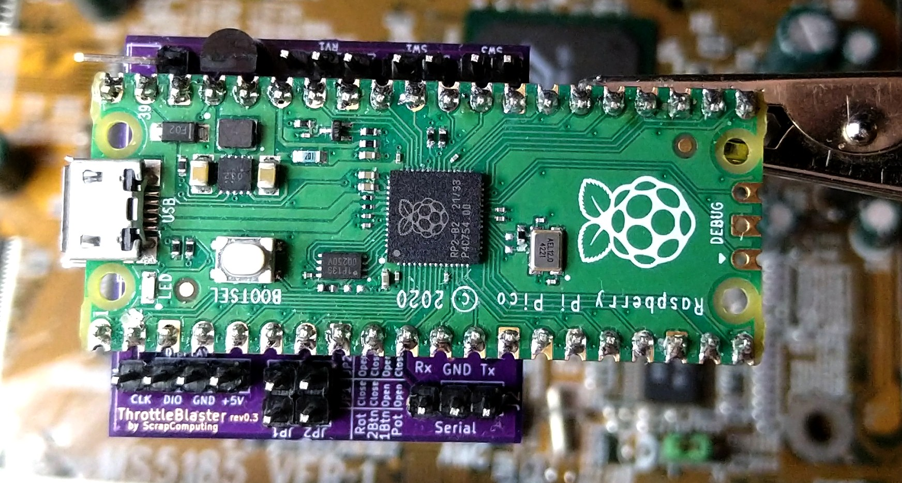

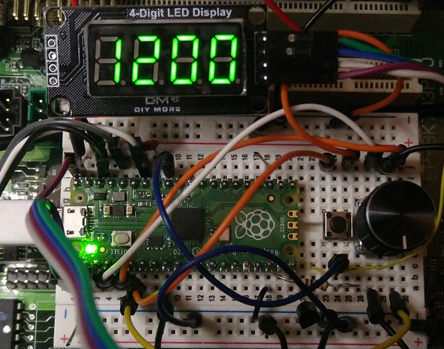

Videos:
- Part 3 (rev 0.3): https://www.youtube.com/watch?v=g4OluJwGDEQ
- Part 2: https://www.youtube.com/watch?v=nGy8OmOe_34
- Part 1: https://www.youtube.com/watch?v=9uNml2j6sy0

- Mounted on a 5.25 panel: https://www.youtube.com/shorts/n1aFvRNtOcw (by Michael Swimm)

Download firmware (ThrottleBlaster.uf2): https://github.com/scrapcomputing/ThrottleBlaster/releases

Download gerbers (ThrottleBlaster_gerbers_rev.X.X.zip): https://github.com/scrapcomputing/ThrottleBlaster/releases

# How it works
The Throttle Blaster is a fancy PWM controller that pulls the CPU's STPCLK# to ground.

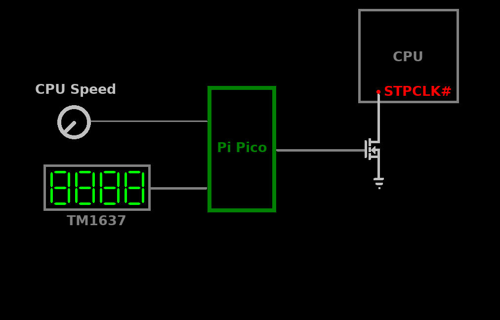

It is tailored to the needs of vintage PC enthusiasts, so it drives a 4-digit 7-segment display and is pre-loaded with presets that span several hardware generations.

# Features
- Four modes of operation to fit your needs, selected by jumpers:
  1. single push-button control. This is great for re-purposing the Turbo button (NOTE: the on/off turbo switch would need to be replaced with a push-button).
  2. Two-button control (left/right).
  3. rotary-encoder with a push-button. This is great for placing it on a drive bay panel.
  4. analogue potentiometer with/without a push-button. This could be used for configurations without a display.
- 7-segment TM1637-based display that shows the effective frequency. This can be considered optional, but is highly recommended.
- Cycle through preset frequencies or select a frequency at a 1MHz granularity.
- Each preset can be tuned/programmed both in terms of the PWM level but also the PWM frequency.
- Configuration changes are permanently stored in the Pico's flash memory.
- The PWM pulses are generated by the Pico's PIOs and are clock-accurate, with no jitter.

# Mode 1: Rotary Encoder (ROT)

- The devices starts at the "Presets" state (mode).
- Turn the knob to select a frequency
- Short push to switch to fine-grain frequency selection

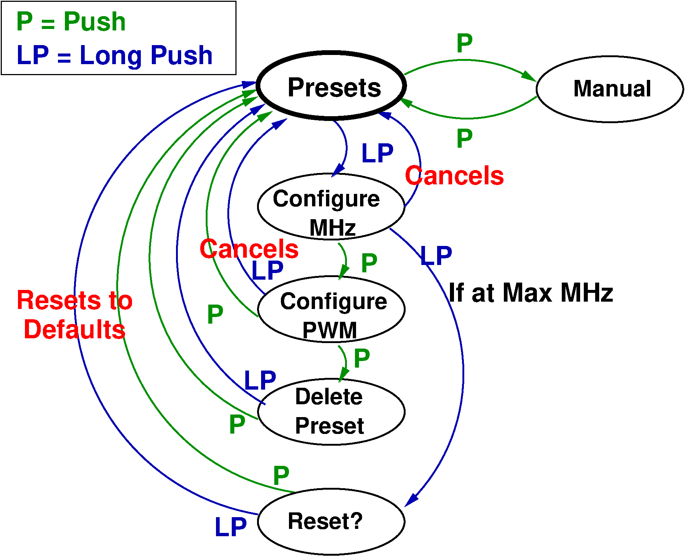

## Initial configuration
- The default CPU frequency is 200MHz. Long push to configure the CPU speed. Select the frequency and short push to get back to the presets.

# Mode 2: Single-button (1Btn)

- The device starts at the "Presets" state.
- Three types of push:
  1. Short push (release immediately)
  2. Medium push (for ~0.5 seconds)
  3. Long push (about 2 seconds)
- Cycle through presets with a short push. A medium push brings us back to the default CPU frequency.
- Long push to enter programming mode.

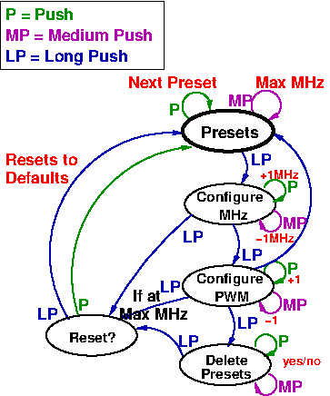

# Mode 3: Two-button (2Btn)

- The device starts at the "Presets" state.
- Two types of push: long and short
- Three types of actions:
  1. Short Left or Right push (release immediately)
  2. Both Left and Right short push
  3. Both Left and Right long push.
- Cycle through presets with a L or R short push.
- Go to 1-1 manual mode with both L and R short push.
- Long push (L or R) to enter programming mode, or to configure the CPU Frequency (CPUF) when showing the maximum frequency.
- Reset to defaults by long press L and R twice.

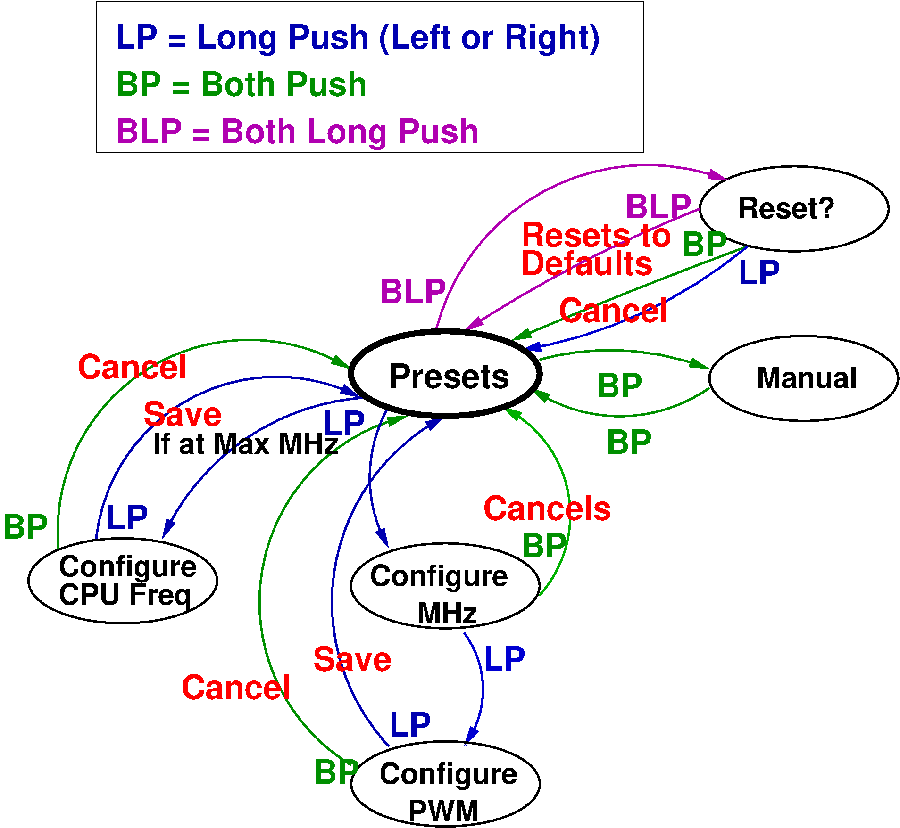

# Mode 4: Potentiometer (POT)

- Can be used in conjunction with the single-button operation. Turning the potentiometer overrides the preset selected by the button.

# Serial Mode (UART): Control by the serial port, works in conjunction with all other modes.

You can connect to the Throttle Blaster via the serial port and set the Frequency and PWM Period.
This is convenient for launching a game with a `.bat` file that first configures the Throttle Blaster and then launches the game.

## Reverse Direction jumper JP3 (since rev 0.4)
Since revision 0.4 the default rotation direction of the knob has been changed and a new jumper JP3 has been added.
Closing the jumper will reverse the direction for both the rotary encoder and the potentiometer.

## Circuit
- Connect the Throttle Blaster's Tx pin to the PC's serial port Rx pin (that is pin 2 of the serial connector), the Throttle Blaster's Rx pin to serial Tx (pin 3) and ground to ground (pin 5)

## Software
- Serial port settings: 9600 8N1, no flow control
- The string to send is in the form `F<MHz>P<Period>\r`, where:
  - `<MHz>` is the desired effective frequency in MHz (float),
  - `<Period>` is the PWM Period level (1-256),
  - `\r` (also seen as `^M`) is the Carriage-Return character (ASCII 13 0x0d).
  - For example `F4.77P8` sets the frequency to `4.77MHz` and the PWM period to `8` which is a around 50us.
- In DOS you can use a terminal emulator, like [Kermit](http://www.columbia.edu/kermit/ftp/archives/msk314.zip), to connect and send the command.
  - You could use this one-liner in a batch file: `kermit set port COM1, set speed 9600, output F4.77P8\13`. This will set the frequency to 4.77 MHz, the period to 8 and will send a Carriage-Return character (`\13`).

> **Note**
> Changing the frequency is not instantaneous. So if you are setting the frequency in a batch file, please consider adding a delay before launching the game.

> **Note**
> Please note that the serial-port functionality is totally optional. You don't need to populate the MAX3232 IC and its capacitors if you are not planning to use it.

# Presets

 Display | Performance equivalence
---------|------------------------
 4       | 4.77 MHz IBM PC
 8       | 8 MHz
 10      | 10 MHz
 25      | 25 MHz
 33      | 33 MHz 486
 66      | 66 MHz 486
 133     | 133 MHz Pentium
 450     | 450 MHz Pentium-II
 733     | 733 MHz Pentium-III

# Firmware

## Dependencies
- (Optional) https://github.com/wahlencraft/TM1637-pico
- C++17 compiler

## Build Instructions
- Download release (v1.2.1) https://github.com/wahlencraft/TM1637-pico and extract it.
- `cd firmware/ && mkdir build && cd build`
- `cmake -DCMAKE_BUILD_TYPE=Release -DPICO_SDK_PATH=/path/to/pico-sdk/ -DPICO_TM1637_PATH=/path/to/TM1637-pico/ ../src/ && make`
- This will place the firmware into: `ThrottleBlaster.uf2` in the `build` directory.

## Installing the firmware
- Unplug the Pico
- Press and hold the small "BOOTSEL" button on the Pico
- While holding the BOOTSEL button, connect the Pico to your PC with a micro-USB cable
- The Pico should show up as a mass-storage device
- Copy the `ThrottleBlaster.uf2` firmware to the drive associated with the Pico
- Safely eject the mass-storage device

The Pico should boot and you should see the Pico's LED light up.

# Circuit

## Schematic

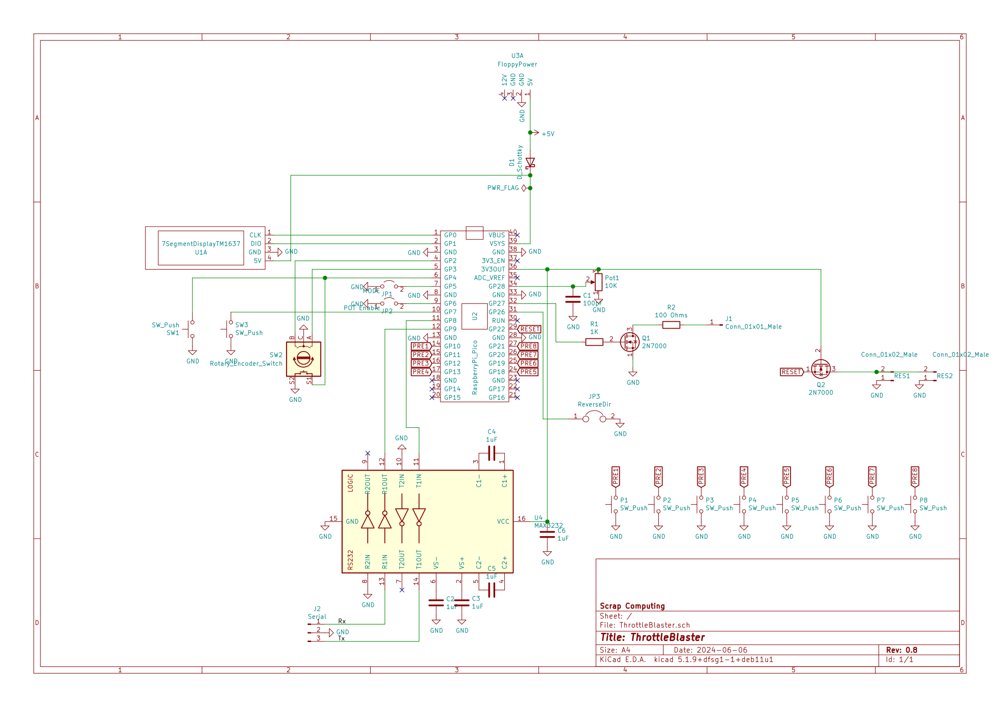

The Throttle Blaster circuit is fairly simple:
- The Rotary Encoder, the Push Button and the Potentiometer are connected to the Pico's GPIOs.
- The Display is also connected directly to GPIOs
- The STPCLK# pin is driven by a N-channel MOSFET, a 2N7000, and its gate pin connects to the Pico's GPIO via a 1K resistor and the transistor's drain connects to STPCLK# via a 100 Ohm resistor.
- The circuit is powered directly from the PSU's 5V power supply via diode (preferrably a Schottky).
- The serial port circuit relies on a MAX3232 for converting the RS232 levels to Pi-Pico levels.

## PCB

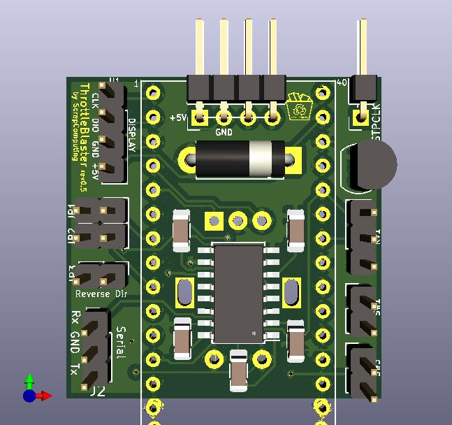
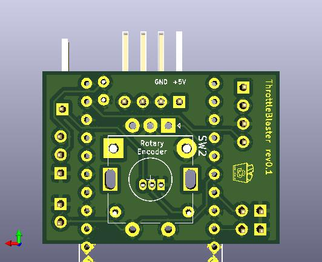

## Bill Of Materials

Download gerbers: https://github.com/scrapcomputing/ThrottleBlaster/releases

Reference      | Quantity          | Value                                                 | Description
---------------|-------------------|-------------------------------------------------------|------------
N/A            | 1 (recommended)   | TM1637 based 4-digit 7-segment display                | The display of the Throttle Blaster
D1             | 1                 | Through-hole diode (preferrably Schottky 1N5817)      | Reverse polarity protection
N/A (for Pico) | 2                 | 1x13 female through-hole pin-header 2.54mm pitch      | For attaching the Pico to the board.
J1             | 1 (optional)      | 1x01 male through-hole angled pin-header 2.54mm pitch | For the STPCLK# cable
J2             | 1 (optional UART) | 1x03 male through-hole pin-header 2.54mm pitch        | For controlling the Throttle Blaster via serial. (Requires MAX3232)
JP1/JP2        | 1                 | 2x02 (or 2x 1x02) male through-hole pin-header 2.54mm | Selects mode of operation.
JP3            | 1                 | 1x02 male through-hole pin-header 2.54mm pitch        | For the JP3 jumper that flips the rotation direction
SW1/SW2        | 2 (optional)      | 1x02 male through-hole pin-header 2.54mm pitch        | For the SW1 and SW2 switches
U1             | 1 (optional)      | 1x04 male through-hole angled pin-header 2.54mm pitch | For connecting the TM1637 7-segment display.
Jumpers        | 2                 | 2.54mm pitch Jumpers                                  | For JP1/JP2
Q1             | 1                 | 2N7000 N-channel MOSFET                               | Pulls down the CPU's STPCLK# pin
R1             | 1                 | 1K Resistor SMD 1206                                  | For the throttle transistor gate.
R2             | 1                 | 100 Ohm Resistor SMD 1206                             | Between the throttle pin and the throttling transistor.
RV1            | 1 (mode POT)      | 10K linear potentiometer                              | Selects Frequency in Potentiometer mode.
SW1            | 1 (mode 1Btn)     | Push button                                           | Selects Frequency in 1Btn mode.
SW3            | 1 (mode 2Btn)     | Push button                                           | The right button in 2Btn mode.
SW2            | 1 (mode ROT)      | Rotary Encoder with push-button, (ALPS EC11E-Switch) Vertical | Selects Frequency in Rotary mode. Note: These are widely available online using keywords like: "rotary encoder switch Arduino" and they can also be found in kits with fitting knobs.
U2             | 1                 | Raspberry Pi Pico                                     |
U3             | 1                 | 1x04 horizontal pin header 2.54mm pitch               | For connecting to the floppy power connector, for powering the unit.
C1             | 1 (mode POT)      | 100pF Disc Ceramic capacitor                          | Used to reduce Potentiometer noise.
C2,C3,C4,C5,C6 | 5 (optional UART) | 1uF Ceramic Capacitor SMD 1206                        | For MAX3232 (serial port)
U4             | 1 (optional UART) | MAX3232 SOIC-16 5.3x10.2mm (Commonly listed as 16-SOIC 3.90mm width) | For controlling the Throttle Blaster via the serial port.

## Using the circuit for the first time
- Select the operation mode using jumpers JP1/JP2.
- Connect J1 to your CPU's STPCLK# pin.
- Power it on and you are good to go.
- You can reverse the knob direction by closing JP3 (since rev.0.4)

## How to find the `STPCLK#` pin
Just look for it in your CPU's datasheet. 
This table lists the STPCLK# pin number for your reference:

  CPU                 | STPCLK# Pin
----------------------|------------
 Pentium MMX          | V34
 Pentium-iii socket   | AG35
 Pentium-iii slot1    | B6
 Athlon XP            | AC1

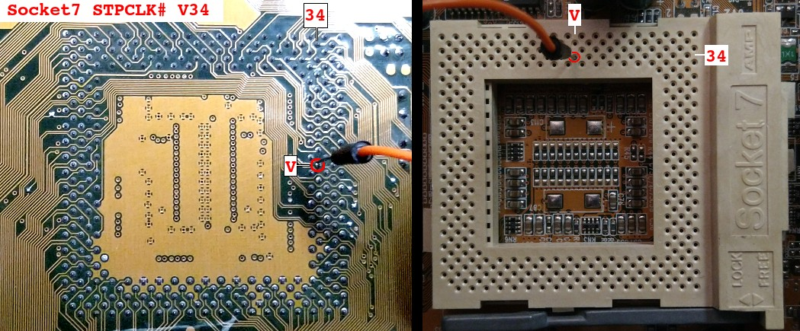

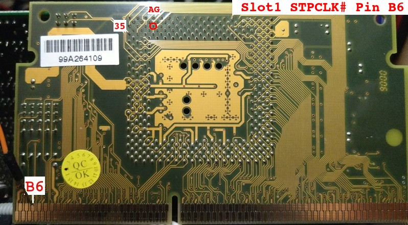

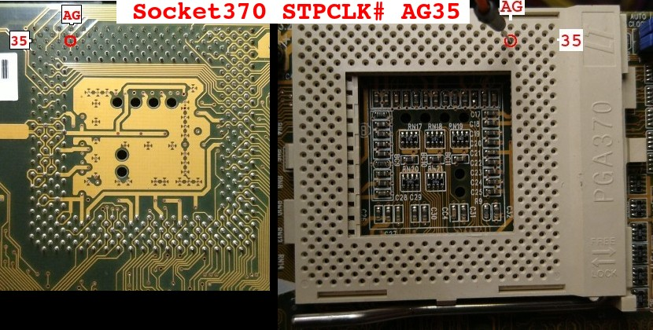

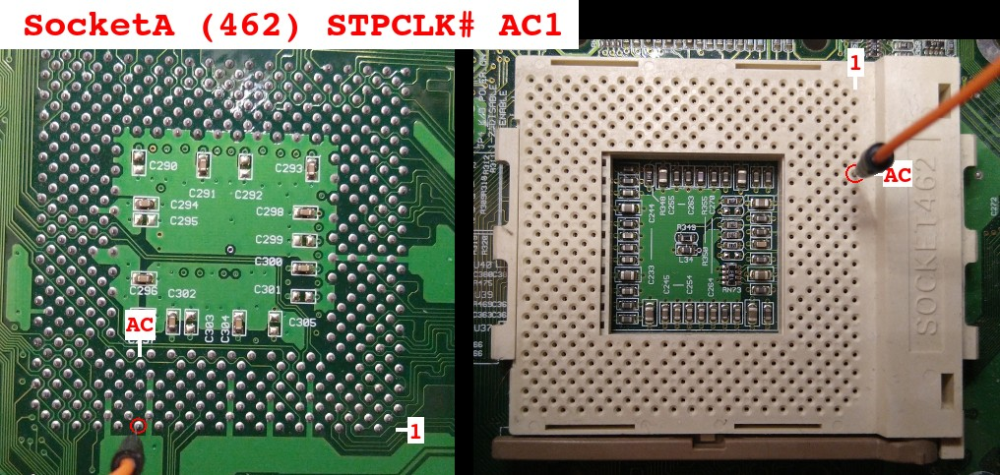

# Change Log
- Rev 0.4: Reverses knob direction and adds jumper JP3 for selecting direction.
- Rev 0.3: Adds UART support in both firmware and PCB.
- Rev 0.2: Adds two-button mode "2Btn".
- Rev 0.1: Initial release.

# License
The project is GPLv2 except for `Pwm.pio` which comes from the Pi Pico SDK examples and is under `SPDX-License-Identifier: BSD-3-Clause`.
