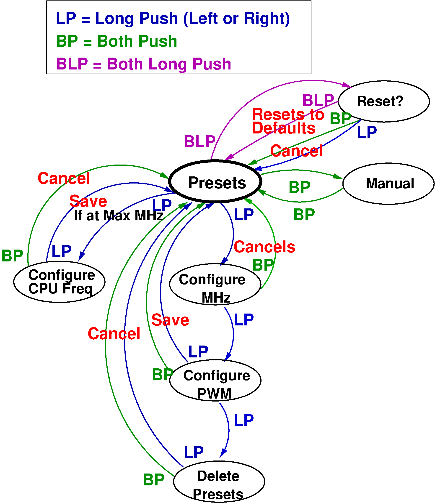

# ThrottleBlaster

A Pi Pico-based solution that reduces the effective frequency of fast CPUs by pulling down the STPCLK# pin at a specified frequency and duty-cycle.

This allows you to play speed-sensitive games, like Digger on a 1200MHz Athlon!

Videos:
- https://www.youtube.com/watch?v=nGy8OmOe_34
- https://www.youtube.com/watch?v=9uNml2j6sy0

Download firmware (ThrottleBlaster.uf2): https://github.com/scrapcomputing/ThrottleBlaster/releases

# How it works
The Throttle Blaster is a fancy PWM controller that pulls the CPU's STPCLK# to ground.

It is tailored to the needs of vintage PC enthusiasts, so it drives a 4-digit 7-segment display and is pre-loaded with presets that span several hardware generations.

# Features
- Three modes of operation to fit your needs, selected by jumpers:
  1. single push-button control. This is great for re-purposing the Turbo button (NOTE: the on/off turbo switch would need to be replaced with a push-button).
  2. rotary-encoder with a push-button. This is great for placing it on a drive bay panel.
  3. analogue potentiometer with/without a push-button. This could be used for configurations without a display.
- 7-segment TM1637-based display that shows the effective frequency. This can be considered optional, but is highly recommended.
- Cycle through preset frequencies or select a frequency at a 1MHz granularity.
- Each preset can be tuned/programmed both in terms of the PWM level but also the PWM frequency.
- Configuration changes are permanently stored in the Pico's flash memory.
- The PWM pulses are generated by the Pico's PIOs and are clock-accurate, with no jitter.

# Mode 1: Rotary Encoder (ROT)

- The devices starts at the "Presets" state (mode).
- Turn the knob to select a frequency
- Short push to switch to fine-grain frequency selection

## Initial configuration
- The default CPU frequency is 200MHz. Long push to configure the CPU speed. Select the frequency and short push to get back to the presets.

# Mode 2: Single-button (1Btn)

- The device starts at the "Presets" state.
- Three types of push:
  1. Short push (release immediately)
  2. Medium push (for ~0.5 seconds)
  3. Long push (about 2 seconds)
- Cycle through presets with a short push. A medium push brings us back to the default CPU frequency.
- Long push to enter programming mode.

# Mode 3: Two-button (2Btn)

- The device starts at the "Presets" state.
- Two types of push: long and short
- Three types of actions:
  1. Short Left or Right push (release immediately)
  2. Both Left and Right short push
  3. Both Left and Right long push.
- Cycle through presets with a L or R short push.
- Go to 1-1 manual mode with both L and R short push.
- Long push (L or R) to enter programming mode, or to configure the CPU Frequency (CPUF) when showing the maximum frequency.
- Reset to defaults by long press L and R twice.

# Mode 4: Potentiometer (POT)

- Can be used in conjunction with the single-button operation. Turning the potentiometer overrides the preset selected by the button.

# Presets

 Display | Performance equivalence
---------|------------------------
 4       | 4.77 MHz IBM PC
 8       | 8 MHz
 10      | 10 MHz
 25      | 25 MHz
 33      | 33 MHz 486
 66      | 66 MHz 486
 133     | 133 MHz Pentium
 450     | 450 MHz Pentium-II
 733     | 733 MHz Pentium-III

# Firmware

## Dependencies
- (Optional) https://github.com/wahlencraft/TM1637-pico
- C++17 compiler

## Build Instructions
- Download release (v1.2.1) https://github.com/wahlencraft/TM1637-pico and extract it.
- `cd firmware/ && mkdir build && cd build`
- `cmake -DCMAKE_BUILD_TYPE=Release -DPICO_SDK_PATH=/path/to/pico-sdk/ -DPICO_TM1637_PATH=/path/to/TM1637-pico/ ../src/ && make`
- This will place the firmware into: `ThrottleBlaster.uf2` in the `build` directory.

## Installing the firmware
- Unplug the Pico
- Press and hold the small "BOOTSEL" button on the Pico
- While holding the BOOTSEL button, connect the Pico to your PC with a micro-USB cable
- The Pico should show up as a mass-storage device
- Copy the `ThrottleBlaster.uf2` firmware to the drive associated with the Pico
- Safely eject the mass-storage device

The Pico should boot and you should see the Pico's LED blinking.

# Circuit

## Schematic

The Throttle Blaster circuit is fairly simple:
- The Rotary Encoder, the Push Button and the Potentiometer are connected to the Pico's GPIOs.
- The Display is also connected directly to GPIOs
- The STPCLK# pin is driven by a N-channel MOSFET, a 2N7000, and its gate pin connects to the Pico's GPIO via a 1K resistor.
- The circuit is powered directly from the PSU's 5V power supply via diode (preferrably a Schottky).

## PCB

## Bill Of Materials
Reference | Quantity     | Value                                            | Description
----------|--------------|--------------------------------------------------|------------
N/A       | 1 (recommended) | TM1637 based 4-digit 7-segment display        | The display of the Throttle Blaster
D1        | 1            | Through-hole diode (preferrably Schottky 1N5817) | Reverse polarity protection
J1        | 1 (optional) | 1x01 pin-header 2.54mm pitch                     | For the STPCLK# cable
JP1/JP2   | 1            | 2x02 pin-header 2.54mm pitch                     | Selects mode of operation
Jumpers   | 2            | 2.54mm pitch Jumpers                             | For JP1/JP2
Q1        | 1            | 2N7000 N-channel MOSFET                          | Pulls down the CPU's STPCLK# pin
R1        | 1            | 1K Resistor 1/8W                                 | Drives the transistor's gate
RV1       | 1 (mode)     | 10K linear potentiometer                         | Selects Frequency in Potentiometer mode.
SW1       | 1 (mode)     | Push button                                      | Selects Frequency in Button mode.
SW2       | 1 (mode)     | Rotary Encoder with push-button, ALPS EC11E-Switch Vertical | Selects Frequency in Rotary mode.
U1        | 1 (optional) | 1x04 pin-header 2.54mm pitch                     | Connects to the TM1637 display
U2        | 1            | Raspberry Pi Pico                                |
U3        | 1            | 1x04 horizontal pin header 2.54mm pitch          | For connecting to the floppy power connector, for powering the unit.
C1        | 1 (mode)     | 100pF Disc Ceramic capacitor                     | Used to reduce Potentiometer noise.

## Using the circuit for the first time
- Select the operation mode using jumpers JP1/JP2.
- Connect J1 to your CPU's STPCLK# pin.
- Power it on and you are good to go.

## How to find the `STPCLK#` pin
Just look for it in your CPU's datasheet. 
This table lists the STPCLK# pin number for your reference:

  CPU                 | STPCLK# Pin
----------------------|------------
 Pentium MMX          | V34
 Pentium-iii socket   | AG35
 Pentium-iii slot1    | B6
 Athlon XP            | AC1

# License
The project is GPLv2 except for `Pwm.pio` which comes from the Pi Pico SDK examples and is under `SPDX-License-Identifier: BSD-3-Clause`.
